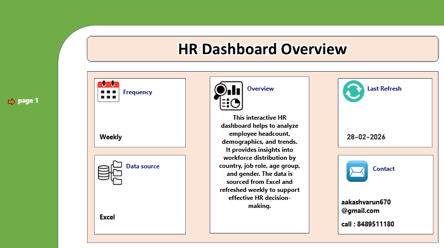
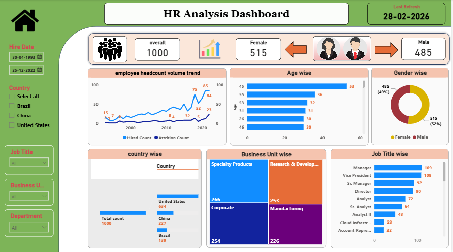

# HR Data Analysis & Power BI Dashboard

## Project Overview

This project focuses on analyzing HR employee data using Microsoft Excel and Power BI.

The data was initially cleaned and prepared in Excel. The cleaned dataset was then imported into Power BI, where additional basic data cleaning and transformation were performed using Power Query.

An interactive HR dashboard was created in Power BI to analyze employee headcount, demographics, hiring trends, workforce distribution and job-related insights.

## Tools Used

- Microsoft Excel
- Power BI Desktop
- Power Query
- Pivot Tables / Excel Data Cleaning
- Data Visualization
- Interactive Dashboard

## Data Preparation Workflow

### 1. Excel Data Cleaning

The raw HR dataset was cleaned and prepared in Excel.

Activities included:

- Removing unnecessary data
- Checking missing values
- Removing duplicate records
- Correcting data formats
- Standardizing column values
- Preparing the dataset for Power BI

### 2. Power BI Import

The cleaned Excel dataset was imported into Power BI Desktop.

### 3. Power Query

Basic data transformation and validation were performed using Power Query.

Activities included:

- Checking data types
- Removing unnecessary columns
- Handling blank values
- Renaming columns where required
- Validating the dataset before analysis

### 4. Dashboard Development

An interactive HR dashboard was created using Power BI.

## Key Analysis

- Employee Headcount
- Hiring Trend
- Attrition Trend
- Gender-wise Employee Distribution
- Age-wise Employee Analysis
- Country-wise Employee Distribution
- Business Unit-wise Analysis
- Job Title-wise Analysis

## Dashboard Features

- Total Employee KPI
- Female and Male Employee KPIs
- Hiring and Attrition Trend
- Age-wise Analysis
- Gender Distribution
- Country-wise Analysis
- Business Unit Analysis
- Job Title Analysis
- Interactive Filters and Slicers

## Dashboard Preview

## Project Files

- HR_Analysis_Dashboard.pbix — Power BI dashboard project
- HR_Dashboard_Overview.png — Dashboard overview
- HR_Dashboard.png — Power BI dashboard preview
- README.md — Project documentation

## Outcome

The project demonstrates an end-to-end HR reporting workflow using Excel and Power BI, from data cleaning and preparation to interactive dashboard development.
